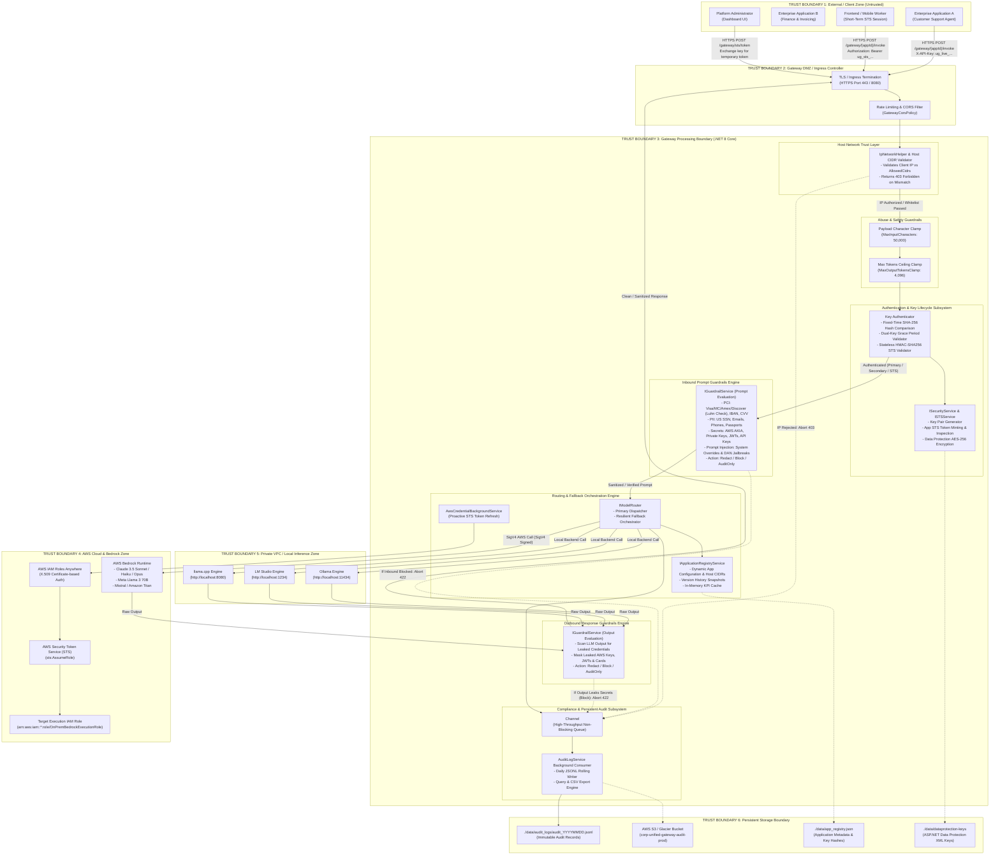
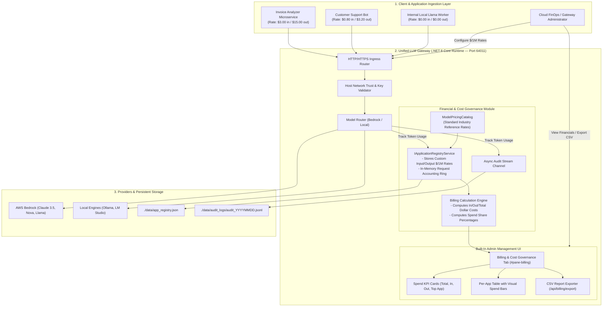
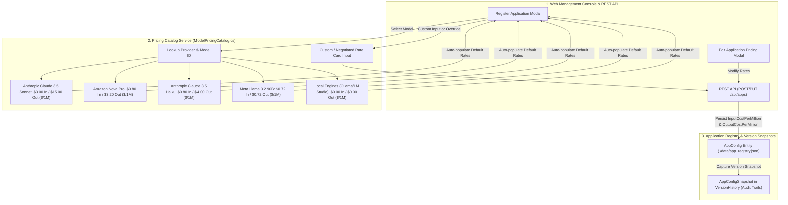
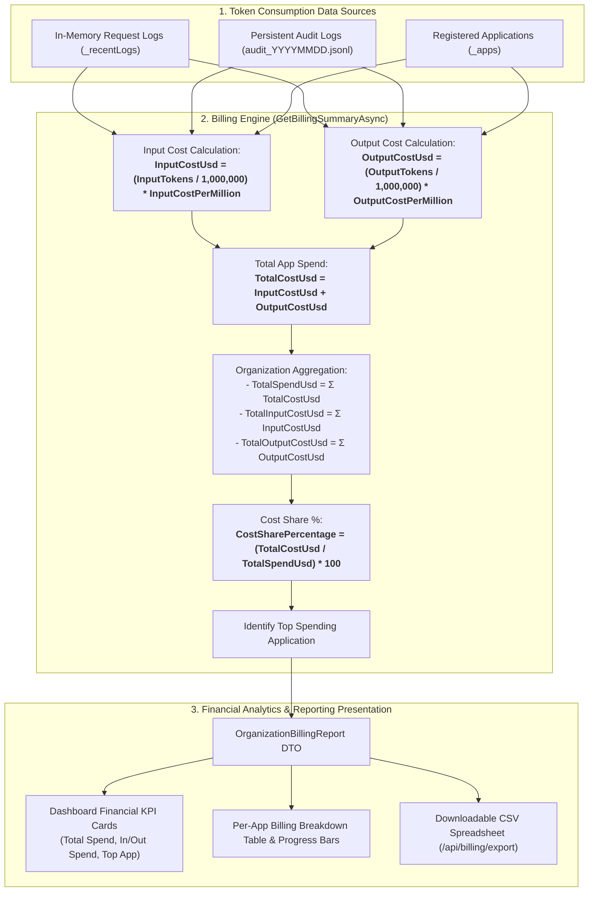

# Enterprise Architecture & Data Flow Specification

**Project:** Universal AI LLM Gateway  
**Runtime:** .NET 8 Minimal API (C#)  
**Target Environments:** Development, Test/Staging, Production (Hybrid On-Premises & AWS Bedrock)  
**Document Version:** 2.5.0  
**Status:** Enterprise Multi-Environment, Host Network Trust & Billing Governance Approved  

---

## 1. Executive Summary & Core Security Principles

The **Universal AI LLM Gateway** provides a hardened, resilient, 100% self-contained enterprise abstraction layer mediating communication between client microservices and Large Language Model (LLM) providers (AWS Bedrock Runtime and Local engines like Ollama, LM Studio, and llama.cpp).

### 1.1 Core Architecture Capabilities

1. **Standalone Built-in Operation:** 100% self-contained .NET 8 service with built-in web management UI, in-memory telemetry, and persistent daily compliance audit logs without any required external monitoring servers.
2. **Dynamic AWS Bedrock Model Discovery & Custom Model ARNs:** Live dynamic foundation models querying via `AmazonBedrockClient.ListFoundationModelsAsync` with curated fallback and support for custom fine-tuned model ARNs.
3. **Multi-Environment Isolation (DEV vs. TEST vs. PROD):**
   - **DEV:** 100% Local storage (`./data/audit_logs`), Developer AWS named profiles (`~/.aws/config`, `default`), **$0/month cloud cost**.
   - **TEST:** On-Premises **AWS IAM Roles Anywhere** X.509 PKI authentication, **Local + AWS S3** cold storage, and AWS KMS Test CMK.
   - **PROD:** On-Premises **AWS IAM Roles Anywhere** X.509 PKI authentication, **Local + AWS S3 Glacier** 365-day compliance archival, and AWS KMS Prod CMK.
4. **Secretless On-Premises Execution:** In TEST and PROD, no permanent AWS access keys (`AKIA...`) are stored on servers; all authentication is mediated via short-lived, auto-refreshing AWS STS session credentials (`sts:AssumeRole`).
5. **Host Network Trust (Source IP / CIDR Whitelisting):** Cryptographic and network binding per registered application; only requests originating from registered server host IPs or CIDR subnets (e.g., `10.240.12.50/32`, `192.168.1.0/24`) are permitted to mint STS tokens or invoke model endpoints. Unauthorized hosts receive **`403 Forbidden: HOST_IP_NOT_AUTHORIZED`**.
6. **Billing & Cost Governance:** Configurable Input and Output Token Cost per 1M tokens per application, automated model catalog pricing synchronization, real-time financial KPI cards, per-application spend share analytics, and 1-click CSV export.
7. **Bidirectional Enterprise Guardrails:** Pre-execution inspection (PCI with Luhn validation, PII, Secrets, Prompt Injection) on inbound prompts and post-execution inspection (Credential/Secret leakage) on outbound model responses.
8. **Zero-Downtime Dual-Key Rotation:** Primary + Secondary key lifecycle with configurable grace period (e.g. 7 days) and emergency instant revocation.
9. **Abuse Protection & Safety Clamps:** 50,000 character prompt limit (`413 Payload Too Large`) and 4,096 token output ceiling clamp.
10. **Persistent Compliance Audit Trail:** Non-blocking async channel writer persisting structured records to daily rolling JSONL files with query and CSV export.

---

## 2. Multi-Environment Topology Architecture

```mermaid
flowchart TD
    subgraph DEV_ENV["1. Development Environment (Local Machine / VM)"]
        DevUser["Developer Workstation"] --> DevGW["Unified Gateway (DEV)"]
        DevGW --> DevStorage["Local Disk Storage<br/>(./data/audit_logs/*.jsonl)"]
        DevGW --> DevProfile["AWS Named Profile<br/>(~/.aws/config, 'default')"]
        DevProfile --> BedrockDev["AWS Bedrock (DEV)"]
    end

    subgraph TEST_ENV["2. Test / Staging Environment (On-Premises Hybrid)"]
        TestApps["Staging Microservices<br/>(Authorized Host IPs)"] --> TestGW["Unified Gateway (TEST)"]
        TestGW --> TestLocal["Local Buffer Storage"]
        TestLocal --> TestS3["AWS S3 Test Bucket<br/>(corp-audit-test)"]
        TestGW --> TestPKI["Enterprise X.509 Certificate<br/>(/etc/pki/gateway/test-client.crt)"]
        TestPKI --> TestRA["AWS IAM Roles Anywhere"]
        TestRA --> TestSTS["Temporary STS Credentials"]
        TestSTS --> BedrockTest["AWS Bedrock (TEST)"]
        TestGW --> TestKMS["AWS KMS Test CMK"]
    end

    subgraph PROD_ENV["3. Production Environment (Hardened On-Premises HA)"]
        ProdApps["Production Microservices<br/>(Authorized Host IPs / Subnets)"] --> ProdGW["Unified Gateway (PROD)"]
        ProdGW --> ProdLocal["Local Buffer Storage"]
        ProdLocal --> ProdS3["AWS S3 Glacier Archive<br/>(corp-audit-prod)"]
        ProdGW --> ProdPKI["Enterprise X.509 Certificate / HSM<br/>(/etc/pki/gateway/prod-client.crt)"]
        ProdPKI --> ProdRA["AWS IAM Roles Anywhere"]
        ProdRA --> ProdSTS["Temporary STS Credentials"]
        ProdSTS --> BedrockProd["AWS Bedrock (PROD)"]
        ProdGW --> ProdKMS["AWS KMS Prod CMK (Multi-Region)"]
    end
```



---

## 3. Host Network Trust & Source IP/CIDR Whitelist Architecture

```mermaid
flowchart TD
    subgraph ClientLayer["1. Incoming Client Request"]
        HostA["Authorized Host A<br/>IP: 10.240.12.50"]
        HostB["Authorized Microservice Subnet<br/>IP: 192.168.1.100 (in 192.168.1.0/24)"]
        Attacker["Unauthorized Host / Rogue Machine<br/>IP: 203.0.113.88"]
    end

    subgraph GatewayBoundary["2. Unified LLM Gateway (/gateway/sts/token & /gateway/{appId}/invoke)"]
        IpExtractor["Extract Client IP<br/>(RemoteIpAddress / X-Forwarded-For)"]
        AppLookup["Lookup AppConfig by appId<br/>Retrieve registered 'AllowedCidrs'"]
        CidrMatcher{"CIDR Matcher<br/>Is Client IP in AllowedCidrs?"}
        
        AuthPipeline["Key / STS Authenticator<br/>(Validate API Key Hash & Expiry)"]
        GuardrailPipeline["Bidirectional Guardrails & Model Router"]
    end

    subgraph Outcomes["3. Authorization Outcomes"]
        Success["200 OK: Process Request & Issue STS Token"]
        Forbidden["403 Forbidden: HOST_IP_NOT_AUTHORIZED<br/>Log Security Violation to Audit Trail"]
    end

    HostA -->|Request with X-API-Key| IpExtractor
    HostB -->|Request with X-API-Key| IpExtractor
    Attacker -->|Stolen X-API-Key| IpExtractor

    IpExtractor --> AppLookup
    AppLookup --> CidrMatcher

    CidrMatcher -->|Allowed: IP in Range| AuthPipeline
    CidrMatcher -->|Allowed: AllowedCidrs Empty (Any Host)| AuthPipeline
    CidrMatcher -->|Denied: IP not in Range| Forbidden

    AuthPipeline --> GuardrailPipeline
    GuardrailPipeline --> Success
```

---

## 4. End-to-End System Architecture & Trust Boundaries



---

## 5. Billing & Cost Governance Architecture

The Billing & Cost Governance subsystem calculates real-time token expenditures and financial chargeback analytics across all applications.

### 5.1 End-to-End Billing & Cost Governance Flow



### 5.2 Token Pricing & Catalog Auto-Resolution



### 5.3 Financial Calculation & Aggregation Data Flow



---

## 6. Verification Evidence

| Verification Area | Status | Test / Artifact Location |
| :--- | :--- | :--- |
| **Token Pricing & Admin Billing Governance** | **PASSED** | [`BillingTests.cs`](file:///c:/Users/wasim/workspace/Projects/Unified-LLM-Gateway/UnifiedGateway.Tests/BillingTests.cs), [`ApplicationRegistryService.cs`](file:///c:/Users/wasim/workspace/Projects/Unified-LLM-Gateway/Services/ApplicationRegistryService.cs) |
| **Host Network Trust & CIDR Whitelisting** | **PASSED** | [`HostNetworkTrustTests.cs`](file:///c:/Users/wasim/workspace/Projects/Unified-LLM-Gateway/UnifiedGateway.Tests/HostNetworkTrustTests.cs), [`IpNetworkHelper.cs`](file:///c:/Users/wasim/workspace/Projects/Unified-LLM-Gateway/Services/IpNetworkHelper.cs) |
| **Multi-Environment Configuration Binding** | **PASSED** | [`MultiEnvironmentTests.cs`](file:///c:/Users/wasim/workspace/Projects/Unified-LLM-Gateway/UnifiedGateway.Tests/MultiEnvironmentTests.cs) |
| **AWS IAM Roles Anywhere & Profile Auth Resolution** | **PASSED** | [`STSService.cs`](file:///c:/Users/wasim/workspace/Projects/Unified-LLM-Gateway/Services/STSService.cs), [`MultiEnvironmentTests.cs`](file:///c:/Users/wasim/workspace/Projects/Unified-LLM-Gateway/UnifiedGateway.Tests/MultiEnvironmentTests.cs) |
| **Bidirectional Guardrails (PCI/PII/Secrets/Output)** | **PASSED** | [`GuardrailServiceTests.cs`](file:///c:/Users/wasim/workspace/Projects/Unified-LLM-Gateway/UnifiedGateway.Tests/GuardrailServiceTests.cs) |
| **Full Automated Unit Test Suite** | **PASSED** | **65/65 tests passing** in `UnifiedGateway.Tests`. |
