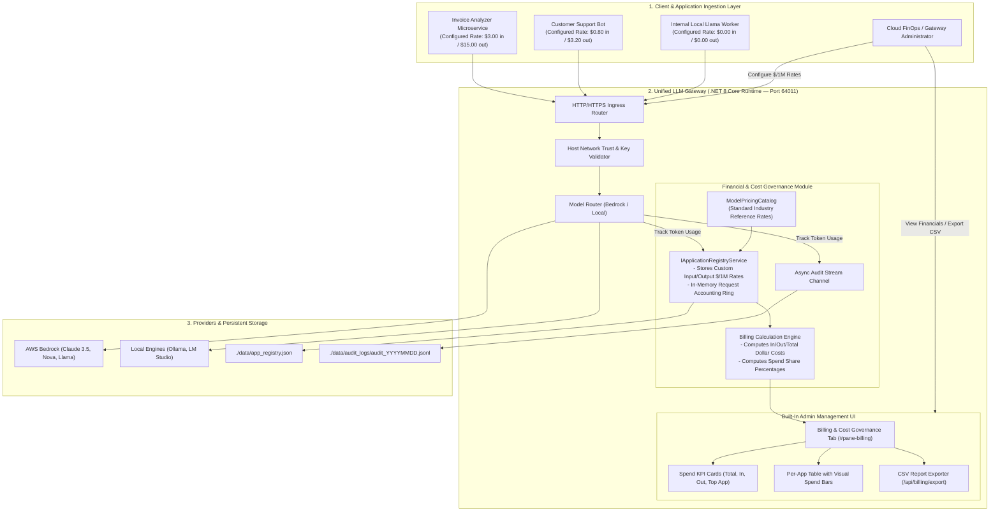
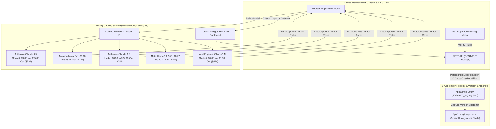
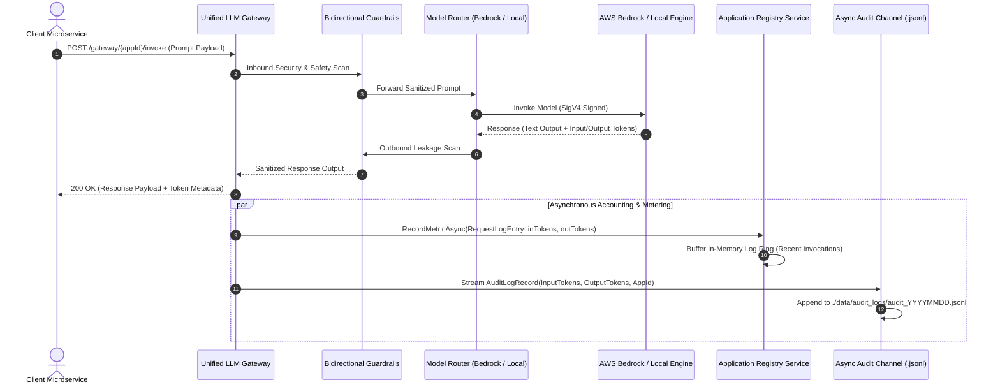
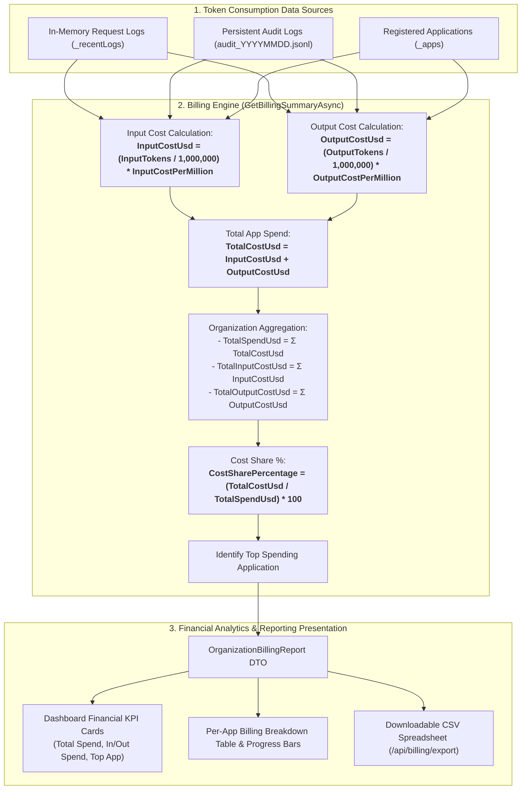

# Billing & Cost Governance Architecture

**Project:** Universal AI LLM Gateway  
**Document:** Billing & Cost Governance Technical Architecture Specification  
**Version:** 1.0.0  
**Status:** Approved & Implemented  

---

## 1. Overview & Objective

The **Billing & Cost Governance Subsystem** provides real-time financial tracking, token usage metering, customizable rate cards, and organization-wide chargeback analytics for all LLM workloads routed through the Unified LLM Gateway.

### Core Capabilities:
1. **Per-Application Dual-Rate Metering:** Separate configurable pricing for **Input Prompt Tokens** and **Output Generation Tokens** expressed in dollars per one million tokens (`$ / 1,000,000 tokens`).
2. **Standard Reference Catalog Pricing:** Out-of-the-box reference pricing auto-populated from foundation model catalogs (Claude 3.5 Sonnet/Haiku, Nova Pro/Lite, Llama 3.2, and Local models at $0.00).
3. **Custom & Negotiated Rate Overrides:** Fully editable text boxes allow enterprise teams to configure negotiated enterprise discounts or customized internal chargeback rates.
4. **Real-Time Financial KPI Cards:** Instant visibility into Total Organization Spend, Total Input Cost, Total Output Cost, and Top Spending Application.
5. **Per-Application Breakdown with Spend Share:** Real-time visibility into token volumes, configured rate cards, dollar amounts, and visual spend share progress bars.
6. **1-Click CSV Financial Export:** Instant export of full billing tables to CSV for accounting, finance, and ERP ingestion.
7. **Zero-Downtime Rate Modifications:** Update rates on running applications at any time; changes take effect immediately across all reporting surfaces.

---

## 2. End-to-End Billing & Cost Governance Architecture



---

## 3. Token Pricing Model & Catalog Auto-Resolution



---

## 4. Runtime Invocation & Token Metering Sequence



---

## 5. Financial Calculation & Aggregation Data Flow



---

## 6. Mathematical Formulas & Rounding Rules

1. **Input Prompt Cost Calculation:**
   $$\text{InputCostUsd} = \text{round}\left( \frac{\text{InputTokens}}{1,000,000} \times \text{InputCostPerMillion}, 6 \right)$$

2. **Output Generation Cost Calculation:**
   $$\text{OutputCostUsd} = \text{round}\left( \frac{\text{OutputTokens}}{1,000,000} \times \text{OutputCostPerMillion}, 6 \right)$$

3. **Per-Application Total Cost:**
   $$\text{TotalCostUsd} = \text{InputCostUsd} + \text{OutputCostUsd}$$

4. **Organization Aggregate Spend:**
   $$\text{TotalSpendUsd} = \sum_{i=1}^{N} \text{TotalCostUsd}_i$$

5. **Spend Share Percentage:**
   $$\text{CostSharePercentage} = \begin{cases} \text{round}\left( \frac{\text{TotalCostUsd}}{\text{TotalSpendUsd}} \times 100, 2 \right), & \text{if } \text{TotalSpendUsd} > 0 \\ 0.0, & \text{otherwise} \end{cases}$$

---

## 7. Data Models & Interface Contracts

### 7.1 `AppBillingSummary` Model
```csharp
public sealed class AppBillingSummary
{
    public string AppId { get; set; } = string.Empty;
    public string Name { get; set; } = string.Empty;
    public string Model { get; set; } = string.Empty;
    public string Provider { get; set; } = string.Empty;
    public long TotalRequests { get; set; }
    public long InputTokens { get; set; }
    public long OutputTokens { get; set; }
    public long TotalTokens => InputTokens + OutputTokens;
    public double InputCostPerMillion { get; set; }
    public double OutputCostPerMillion { get; set; }
    public decimal InputCostUsd { get; set; }
    public decimal OutputCostUsd { get; set; }
    public decimal TotalCostUsd { get; set; }
    public double CostSharePercentage { get; set; }
    public DateTimeOffset? LastInvokedAt { get; set; }
    public bool IsActive { get; set; } = true;
}
```

### 7.2 `OrganizationBillingReport` Model
```csharp
public sealed class OrganizationBillingReport
{
    public decimal TotalSpendUsd { get; set; }
    public decimal TotalInputCostUsd { get; set; }
    public decimal TotalOutputCostUsd { get; set; }
    public long TotalTokens { get; set; }
    public long TotalInputTokens { get; set; }
    public long TotalOutputTokens { get; set; }
    public long TotalRequests { get; set; }
    public string HighestSpendingAppId { get; set; } = string.Empty;
    public string HighestSpendingAppName { get; set; } = string.Empty;
    public decimal HighestSpendingAppAmountUsd { get; set; }
    public List<AppBillingSummary> AppBills { get; set; } = new();
    public DateTimeOffset GeneratedAt { get; set; } = DateTimeOffset.UtcNow;
}
```

---

## 8. REST API Endpoints

| Method | Route | Description | Response Content |
| :--- | :--- | :--- | :--- |
| `GET` | `/api/billing` | Retrieves the complete organization billing report and per-app cost breakdown. | `application/json` (`OrganizationBillingReport`) |
| `GET` | `/api/billing/export` | Downloads the current billing report as a standard formatted CSV attachment. | `text/csv` (`billing_report_YYYYMMDD_HHmmss.csv`) |
| `POST` | `/api/apps` | Registers a new application with custom `InputCostPerMillion` and `OutputCostPerMillion`. | `application/json` (`AppRegistrationResponse`) |
| `PUT` | `/api/apps/{appId}` | Updates configuration and token pricing rates for an existing registered application. | `application/json` (`AppConfig`) |
