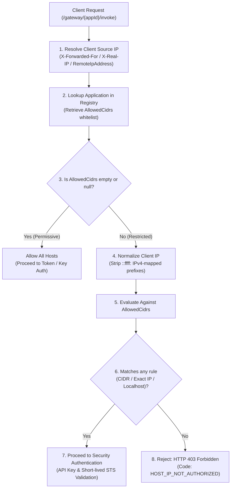

# Host Network Trust: CIDR Matcher Architecture & Implementation Details

## 1. Executive Summary & Security Objectives

In the **Unified LLM Gateway**, the **Host Network Trust (CIDR Matcher)** subsystem provides per-application Layer 3 / Layer 4 network perimeter isolation. It ensures that an AI microservice or client application cannot invoke gateway endpoints unless its originating IP address falls within the whitelisted **CIDR subnets** or **IP addresses** registered for that specific application.

### Key Capabilities
- **Zero-Trust Network Boundary**: Restricts invocation access even if an API key or STS token is compromised.
- **High-Performance Bitwise Matching**: Microsecond-level subnet evaluation using bit shifts and binary masking without string parsing loops or external library overhead.
- **Dual-Stack IP Support**: Native handling for IPv4 (`/32` down to `/0`) and IPv6 (`/128` down to `/0`).
- **IPv4-Mapped IPv6 Normalization**: Automatically flattens `::ffff:x.x.x.x` dual-stack representations.
- **Localhost & Loopback Aliases**: Seamless developer ergonomics for local testing (`localhost`, `127.0.0.1`, `::1`).

---

## 2. Request Lifecycle & Architecture Pipeline



---

## 3. Detailed Step-by-Step Implementation

The CIDR matching logic is encapsulated in [`IpNetworkHelper.cs`](../Services/IpNetworkHelper.cs) and enforced by [`ApplicationRegistryService.cs`](../Services/ApplicationRegistryService.cs) and [`GatewayEndpoints.cs`](../Endpoints/GatewayEndpoints.cs).

### Step 1: Client IP Resolution
Incoming HTTP requests pass through [`GatewayEndpoints.ResolveClientIp(HttpContext)`](../Endpoints/GatewayEndpoints.cs):
1. Inspects the `X-Forwarded-For` header (picks the first untrusted upstream client IP).
2. Inspects the `X-Real-IP` header (reverse proxy fallback).
3. Falls back to direct TCP socket connection metadata: `httpContext.Connection.RemoteIpAddress`.

```csharp
private static IPAddress? ResolveClientIp(HttpContext context)
{
    if (context.Request.Headers.TryGetValue("X-Forwarded-For", out var forwardedFor) && !string.IsNullOrWhiteSpace(forwardedFor))
    {
        var firstIp = forwardedFor.ToString().Split(',')[0].Trim();
        if (IPAddress.TryParse(firstIp, out var parsedIp)) return parsedIp;
    }

    if (context.Request.Headers.TryGetValue("X-Real-IP", out var realIp) && !string.IsNullOrWhiteSpace(realIp))
    {
        if (IPAddress.TryParse(realIp.ToString().Trim(), out var parsedRealIp)) return parsedRealIp;
    }

    return context.Connection.RemoteIpAddress;
}
```

---

### Step 2: IP Normalization & Loopback Alias Resolution
Dual-stack sockets often present IPv4 clients wrapped in IPv6 mapping (e.g., `::ffff:192.168.1.50`). The matcher normalizes these to standard IPv4:
```csharp
var normalizedIp = clientIp.IsIPv4MappedToIPv6 ? clientIp.MapToIPv4() : clientIp;
```

If the rule contains `"localhost"`, it evaluates `IPAddress.IsLoopback(clientIp)`, accepting `127.0.0.1`, `::1`, and any loopback address range.

---

### Step 3: Rule Parsing (Subnet CIDR vs Exact IP)
Each rule in `AllowedCidrs` is parsed:
- **Subnet (contains `/`)**: e.g., `10.0.0.0/16` $\rightarrow$ IP part = `10.0.0.0`, Prefix Length = `16`.
- **Exact IP (no `/`)**: e.g., `192.168.1.100` $\rightarrow$ Prefix Length = `-1` (exact byte equality).

---

### Step 4: High-Performance IPv4 Bitwise Masking (`MatchesIPv4Cidr`)

For IPv4, the matcher converts 4 octet bytes into 32-bit unsigned integers (`uint`) and applies a bitmask:

#### Bitmask Mathematical Formula:
$$\text{mask} = \begin{cases} 0 & \text{if } \text{prefixLength} = 0 \\ \text{uint.MaxValue} \ll (32 - \text{prefixLength}) & \text{if } \text{prefixLength} > 0 \end{cases}$$

$$\text{isMatch} = (\text{clientInt} \ \& \ \text{mask}) == (\text{ruleInt} \ \& \ \text{mask})$$

#### C# Implementation:
```csharp
private static bool MatchesIPv4Cidr(IPAddress clientIp, IPAddress ruleIp, int prefixLength)
{
    var clientBytes = clientIp.GetAddressBytes();
    var ruleBytes = ruleIp.GetAddressBytes();

    var clientInt = (uint)((clientBytes[0] << 24) | (clientBytes[1] << 16) | (clientBytes[2] << 8) | clientBytes[3]);
    var ruleInt   = (uint)((ruleBytes[0] << 24) | (ruleBytes[1] << 16) | (ruleBytes[2] << 8) | ruleBytes[3]);

    var mask = prefixLength == 0 ? 0u : uint.MaxValue << (32 - prefixLength);

    return (clientInt & mask) == (ruleInt & mask);
}
```

---

### Step 5: IPv6 Byte & Bitwise Slicing (`MatchesIPv6Cidr`)

For 128-bit IPv6 addresses:
1. Compares all full 8-bit bytes (`prefixLength / 8`).
2. Computes mask on remaining bits (`prefixLength % 8`) using `(0xFF << (8 - remainingBits))`.

```csharp
private static bool MatchesIPv6Cidr(IPAddress clientIp, IPAddress ruleIp, int prefixLength)
{
    var clientBytes = clientIp.GetAddressBytes();
    var ruleBytes = ruleIp.GetAddressBytes();

    var fullBytes = prefixLength / 8;
    var remainingBits = prefixLength % 8;

    for (var i = 0; i < fullBytes; i++)
    {
        if (clientBytes[i] != ruleBytes[i]) return false;
    }

    if (remainingBits > 0 && fullBytes < 16)
    {
        var mask = (byte)(0xFF << (8 - remainingBits));
        if ((clientBytes[fullBytes] & mask) != (ruleBytes[fullBytes] & mask))
        {
            return false;
        }
    }

    return true;
}
```

---

## 4. Practical Evaluation Matrix

| Client IP | Configured `AllowedCidrs` Rule | Evaluation Result | Rationale |
| :--- | :--- | :--- | :--- |
| `10.0.4.15` | `10.0.0.0/16` | ✅ **Allowed** | First 16 bits match `10.0.0.0/16` subnet |
| `10.1.4.15` | `10.0.0.0/16` | ❌ **Denied (403)** | Second octet `1` does not match `0` |
| `192.168.1.50` | `192.168.1.50` | ✅ **Allowed** | Exact IP match (`/32` equivalent) |
| `192.168.1.51` | `192.168.1.50` | ❌ **Denied (403)** | Exact IP mismatch |
| `127.0.0.1` | `localhost` | ✅ **Allowed** | Loopback alias matches IPv4 loopback |
| `::1` | `localhost` | ✅ **Allowed** | Loopback alias matches IPv6 loopback |
| `::ffff:10.0.5.1` | `10.0.0.0/16` | ✅ **Allowed** | Normalized from IPv6-mapped IPv4 |
| `2001:db8::1` | `2001:db8::/32` | ✅ **Allowed** | First 32 bits match IPv6 subnet |
| `172.16.0.5` | `[]` *(empty list)* | ✅ **Allowed** | Empty whitelist allows all hosts by default |

---

## 5. Gateway Enforcement & Error Contract

When access is denied due to CIDR violation, the gateway halts execution before model dispatching or secret key verification, returning an explicit HTTP 403 response:

```http
HTTP/1.1 403 Forbidden
Content-Type: application/json

{
  "output": "",
  "appId": "fraud-analyzer",
  "error": {
    "code": "HOST_IP_NOT_AUTHORIZED",
    "message": "Access Denied: Host IP '203.0.113.45' is not in the authorized CIDR whitelist for application 'fraud-analyzer'."
  }
}
```

---

## 6. Automated Unit Tests

The CIDR matcher is verified by comprehensive unit tests in [`HostNetworkTrustTests.cs`](../UnifiedGateway.Tests/HostNetworkTrustTests.cs):

```powershell
& "C:\Program Files\dotnet\dotnet.exe" test UnifiedGateway.Tests\UnifiedGateway.Tests.csproj --filter "FullyQualifiedName~HostNetworkTrustTests"
Passed! - Failed: 0, Passed: 7, Skipped: 0, Total: 7
```
